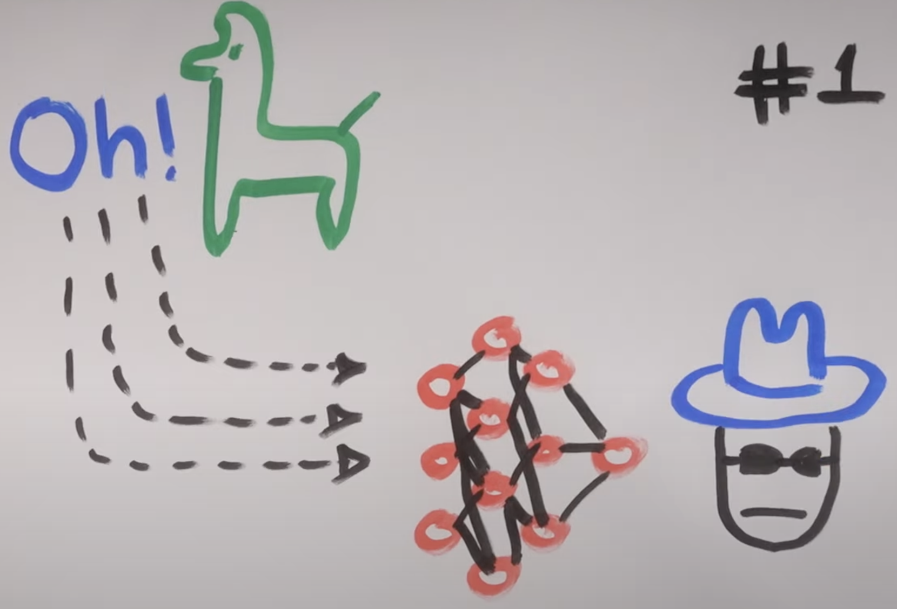

# CrewAI Property Research

Build a crew ai crew that performs property research using Ollama.

# Startup 🦙

0. Install <a href="https://ollama.com/download">Ollama</a>

1. Download openhermes `ollama pull openhermes`
2. Create a virtual environment `conda create -n crew python=3.11`
3. Activate it `conda activate crew`
4. Install initial deps `pip install 'crewai[tools]'`
5. Update the `SERPER_API_KEY` value with an API key from <a href="https://serper.dev/api-key">Serper</a>

6. Run the flow using `python main.py`

 
# Other References 🔗

-<a href="https://github.com/joaomdmoura/crewAI)">CrewAI</a>:documentation for the framework.

# Who, When, Why?

👨🏾‍💻 Author: Anish Soni  
📅 Version: 1.x 
📜 License: This project is licensed under the MIT License  
